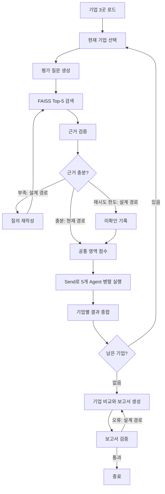

# 배터리 AI 스타트업 투자평가: 설계·구현 발표 자료

> SKALA 4기 · 울산 3반 · 4조  
> 평가 기준에 맞춰 LangChain, LangGraph, Agentic RAG의 설계 의도와 현재 구현 상태를 설명한다. 이 문서는 저장소의 현재 코드를 기준으로 작성했으며, **구현된 기능과 아직 설계 단계인 기능을 구분한다.**

## 1. 문제 정의: 왜 이 시스템이 필요한가

배터리 AI 스타트업을 투자 관점에서 비교하려면 SOC·SOH·RUL 예측, 고객 도입, 매출, 안전성, 데이터 이용 권한, 팀의 실행력까지 검토해야 한다. 하지만 기업마다 공개한 지표와 시험 조건이 다르고, 회사의 주장과 독립적인 검증 자료가 섞여 있다. 예를 들어 두 기업이 모두 높은 예측 정확도를 주장하더라도 배터리 화학계, 표본 수, 예측 시점이 다르면 그 수치를 직접 비교하기 어렵다.

이에 ACCURE Battery Intelligence, volytica diagnostics, Electra Vehicles의 문서에서 **판단에 필요한 근거를 검색**하고, **다섯 투자 관점으로 각각 평가**한 뒤, **기업별 비교와 미확인 사항을 보고서로 전달**하도록 설계했다. 공개자료가 없는 항목은 임의의 사실로 채우지 않고 추가 실사 대상으로 남기는 것이 목표다.

## 2. LangChain·LangGraph·Agentic RAG의 역할 분담

| 기술 | 이 프로젝트에서 맡은 일 | 주요 코드 |
|---|---|---|
| LangChain | PDF/TXT 로딩, 청킹, 임베딩, FAISS 검색, LLM 프롬프트와 구조화 출력 | [`src/rag/ingest.py`](src/rag/ingest.py), [`src/rag/vector_store.py`](src/rag/vector_store.py), [`src/agents/profile.py`](src/agents/profile.py) |
| LangGraph | State를 통한 데이터 전달, 노드 실행 순서, 조건부 분기, 기업 반복, 다섯 Agent 병렬 실행 | [`src/graph.py`](src/graph.py), [`src/schemas.py`](src/schemas.py) |
| RAG | 현재 기업과 평가 질문에 관련된 문서 청크를 검색해 Agent의 판단 입력으로 전달 | [`src/nodes/core.py`](src/nodes/core.py) |
| Agentic RAG 설계 | 근거가 부족하면 질의를 바꾸어 재검색하고, 한도에 도달하면 미확인으로 기록하는 피드백 흐름 | [`src/graph.py`](src/graph.py)의 조건부 경로 |
| Pydantic | 근거, Agent 결과, 기업별 결과의 필드와 자료형 정의 | [`src/schemas.py`](src/schemas.py) |

설계의 핵심은 **근거 수집**과 **투자 판단**의 분리다. 다섯 Agent는 서로 다른 자료를 임의로 수집하는 대신 공통 검색 결과를 받고, 투자 성향에 따라 이를 해석한다. 현재 코드에서는 기본 검색과 병렬 평가 경로가 연결되어 있다. 근거 부족에 따른 자동 재검색은 그래프의 경로만 존재하며 아직 실제로 작동하지 않는다.

## 3. 문서 적재와 임베딩 모델 선택

`main.py`는 입력 문서를 준비한 뒤 `ingest_documents()`를 호출한다. 현재 적재 코드는 `data/raw/`의 PDF와 TXT를 읽는다. LangChain의 `PyPDFLoader`·`TextLoader`로 본문을 가져오고, `RecursiveCharacterTextSplitter`로 **500자 청크와 50자 중첩**을 만든다. 청크가 지나치게 길어 검색 결과가 흐려지는 것을 줄이면서 문장 경계의 문맥을 일부 유지하려는 설정이다. 이후 임베딩을 계산해 FAISS 인덱스로 저장한다.

**실제 적용된 임베딩 모델은 오픈소스 `intfloat/multilingual-e5-base`다.** `HuggingFaceEmbeddings`를 CPU에서 실행하고 임베딩을 정규화한다. 다국어 문서 검색과 별도 GPU 없이 실행할 수 있는 구성을 목표로 했다. 다만 모델 간 Hit@5·MRR@5 비교 수치는 저장소에서 확인되지 않으므로, 검색 품질의 우수성이 실험으로 입증되었다고 말할 수는 없다. 기존 README에서 OpenAI `text-embedding-3-small`을 실제 최종 모델로 소개한 내용은 현재 코드와 다르다.

문서 메타데이터에는 출처 유형·등급·기업명 등을 담으려 했으나, 현재 적재 코드는 문서를 기본적으로 **B등급·직접 근거**로 표시한다. 문서의 실제 신뢰도나 기업 직접성을 검증해 붙이는 기능은 없다. 출처 ID·원본 페이지·URL을 보고서까지 일관되게 전달하는 작업도 남아 있다.

## 4. Evidence RAG: 질문 생성부터 근거 전달까지

기업을 선택하면 `build_questions()`가 기술·시장·재무·안정성·팀 영역의 질문을 만든다. **현재 공통 검색 단계의 질문은 영역별 1개씩 총 5개**다. 별도 `configs/rubric.yaml`에는 **11개 세부 항목**이 정의되어 있고, 일부 프로필 내부의 근거 충족 검사에 사용된다. README에 제시된 29개 항목이 공통 검색에서 모두 실행되는 상태는 아니다.

각 질문에 대한 현재 실행 순서는 다음과 같다.

1. `현재 기업명 + 평가 질문`으로 검색문을 만든다.
2. FAISS에서 유사한 문서 청크 **Top-5**를 찾는다.
3. 검색된 본문과 질문 ID·출처 정보를 `Evidence` 객체로 변환한다.
4. 결과를 `validated_evidence`로 전달해 Agent가 사용한다.

설계한 검증 기준은 질문과의 관련성, 대상 기업과의 직접성, 출처 등급, 성능 수치의 시험 조건, 자료 간 상충 여부다. 근거가 부족하면 질의를 수정해 재검색하고, 최대 횟수 이후에도 확인되지 않으면 미확인으로 기록하려 했다. **현재 공통 `validate_evidence()`는 검색 결과를 그대로 통과시키며 `rewrite_query()`는 아무 질의도 바꾸지 않는다.** `route_evidence_check()`도 근거가 항상 충분하다고 가정한다. 따라서 이 부분은 완성된 자동 피드백 루프가 아니라 확장을 위해 마련한 Graph 구조다.

프로필 내부에는 별도의 확인 로직이 있다. 기술형은 LLM이 인용한 문구가 실제 입력 청크에 있는지 검사하고, 다른 세 프로필이 공유하는 근거 검사도 항목별 답·인용·상충 여부를 확인한다. 이 검사는 **인용문이 입력 청크에 있다는 사실**을 확인한다. 원출처의 사실성이나 독립 검증 여부까지 자동으로 보증하지는 않는다.

## 5. LangGraph Workflow·Loop·Branch

`InvestmentAgentState`에는 현재 기업, 질문, 검색 결과, 검증 결과, 영역 점수, 프로필별 결과, 기업별 결과와 보고서가 구분되어 있다. 노드는 필요한 상태 필드만 갱신한다. `profile_results`는 병렬 Agent 결과를 모으는 reducer를, `company_results`는 기업별 결과를 쌓는 reducer를 사용한다.



`Send`는 동일한 `profile_agent` 노드를 다섯 프로필 입력으로 병렬 실행한다. 결과를 모아 한 기업의 평균과 편차를 계산하고, 결과를 저장한 뒤 다음 기업으로 돌아간다. 이 **기업 반복 경로**는 코드에 연결되어 있다. 반면 **근거 재검색 분기**와 **보고서 오류 수정 루프**는 각각 충분성 판단과 오류 검사가 임시 처리이므로 실효성이 없다.

## 6. 다섯 Profile Agent의 책임과 데이터 흐름

| Agent | 중점 평가 | 기술 | 시장 | 재무 | 안정성 | 팀·사업 |
|---|---|---:|---:|---:|---:|---:|
| 기술중심형 | 예측 성능·검증 신뢰성·데이터·BMS/ESS 연동 | 35% | 20% | 10% | 15% | 20% |
| 안정형 | 안전·규제·재무 지속성·데이터 권리 | 15% | 15% | 30% | 30% | 10% |
| 성장형 | 시장 성장·고객 전환·확장성 | 20% | 35% | 15% | 10% | 20% |
| 균형형 | 다섯 영역과 영역 간 연결성 | 20% | 20% | 20% | 20% | 20% |
| 사업성중심형 | 수익모델·고객·계약·팀 실행력 | 15% | 25% | 20% | 10% | 30% |

프로필 이름과 가중치는 [`configs/profiles.yaml`](configs/profiles.yaml)에 있다. `profile_agent_node()`가 이름에 따라 담당 구현 파일로 보내고, 각 Agent는 공통 `ProfileResult` 형태로 점수, 판정, 찬성·반대 근거 ID, 미확인 항목, 실사 질문을 반환하도록 설계되었다. 이 프로젝트의 Agent 협업은 **같은 근거를 받은 병렬 평가와 결과 종합**이다. Agent끼리 토론하거나 다수결 투표로 합의하는 단계는 구현되어 있지 않다.

현재 프로필 점수는 영역 가중치만 다르게 적용하는 방식이 아니다. 각 프로필에 별도 세부 평가가 추가된다.

```text
공통 프로필 점수 = Σ(영역 점수 × 해당 Agent의 영역 가중치)
Agent 최종점수 = 공통 프로필 점수 × 0.70 + Agent별 세부 점수 × 0.30
```

기술형은 세부 점수 안에서 **예측 성능 30%, 검증 신뢰성 25%, 데이터 경쟁력 25%, 현장 연동성 20%**를 사용한다. 유효한 원문 인용이 없거나 핵심 근거가 상충하면 점수를 내지 않는다. 회사 주장만 있는 경우 2점, 독립 검증이 부족한 경우 4점으로 상한을 둔다. 핵심 지표가 빠졌거나 가중 근거 충족률이 80%에 미치지 못하면 `None`과 판단 유보를 반환한다.

프로필의 자료 부족 처리는 아직 통일되지 않았다. 일부 균형형·성장형 조건에서는 판단 유보 결과 대신 예외가 발생해 전체 Graph 실행이 중단될 수 있다. 안정형은 근거 문서의 신뢰도와 기업의 안정성을 같은 점수로 취급할 수 있고, 사업성형은 “매출 없음”처럼 부정적인 문장에 포함된 키워드도 긍정 근거로 가산할 수 있다. 따라서 역할 분리는 구현되었지만 **각 Agent 채점의 의미가 타당한지**는 추가 검증이 필요하다.

## 7. 평가 기준·최종 판정

설계상 공통 평가는 기술·시장·재무·안정성·팀의 다섯 영역을 1~5점 세부 척도로 평가하고, 확인된 항목의 가중평균을 100점으로 변환한다. 미확인을 낮은 성과로 단정하지 않는 것이 원칙이다.

```text
설계한 영역 점수 = 확인된 세부 항목의 가중평균 × 20
기업 최종지표 = 산출된 Agent 점수의 평균
관점 차이 = 산출된 Agent 점수의 표준편차
```

종합 노드는 미산출 Agent가 있거나 근거 부족 판정이 있으면 최종 판단을 유보하고, 추가 실사 판정도 높은 평균점수로 덮어쓰지 않도록 구성되어 있다. 점수 75점 이상과 공통 근거 충족률 80% 이상을 추천 기준으로 사용한다.

**현재 공통 점수 계산은 임시값이다.** `score_common()`이 기업·검색 근거와 관계없이 기술 90, 시장 80, 재무 70, 안정성 84, 팀 96점 및 근거 충족률 85%를 반환한다. Agent 점수의 70%가 이 값에 의존하므로, 저장된 숫자를 기업별 실측 평가 결과로 제시해서는 안 된다.

## 8. 보고서 설계와 현재 산출물

Graph는 세 기업의 결과를 모아 Markdown과 PDF 보고서를 작성하도록 연결되어 있다. 보고서의 목적은 기업 간 점수·판정과 Agent별 이견을 보여주고, 미확인 사항을 다음 실사 질문으로 연결하는 것이다. 기존 [`output/final_multi_agent_report.md`](output/final_multi_agent_report.md)와 `output/final_report.pdf`가 저장되어 있다.

현재 산출물에는 검증 한계가 있다. 기존 보고서의 세 기업은 공통 영역점수, 충족률 **85%**, 최종점수 **83.53점**이 같다. 공통 점수가 고정값이므로 이 결과만으로 실제 기업 간 차이를 입증하기 어렵다. 근거 ID와 원문·페이지를 보고서 주장에 역으로 연결하는 기능도 부족하다. 기존 PDF는 README의 **5쪽 이내** 목표와 달리 17쪽이다.

현재 생성 코드에도 비교표의 **9열 헤더와 16열 데이터 행** 불일치가 있고, Agent 점수가 `None`이면 일부 숫자 서식에서 오류가 난다. 보고서 검증 노드는 항상 오류가 없다고 반환한다. 따라서 기존 파일의 존재와 **현재 코드로 새 보고서를 안정적으로 재생성할 수 있는지**는 별도로 확인해야 한다.

## 9. 프로젝트 구성과 실행 재현성

```text
main.py                    실행 진입점: 환경 확인 → 파일 준비 → 인덱싱 → Graph 실행
configs/profiles.yaml      프로필 이름·영역 가중치·평가 초점
configs/rubric.yaml        세부 평가 질문과 판정 설정
src/schemas.py             Evidence, ProfileResult, CompanyResult, Graph State
src/rag/ingest.py          문서 로딩·청킹·FAISS 인덱스 생성
src/rag/vector_store.py    임베딩 모델 설정·FAISS 검색
src/agents/profile.py      프로필 라우팅과 공통 점수 함수
src/agents/profiles/       다섯 Agent의 세부 평가
src/nodes/core.py          질문·검색·종합·보고서 노드
src/graph.py               LangGraph 노드와 엣지
src/report_generator.py    PDF 생성
output/                    생성된 보고서
```

README의 권장 실행 명령은 다음과 같다. OpenAI LLM 호출에는 `OPENAI_API_KEY`가 필요하다.

```bash
uv run python main.py
```

실행 진입점에는 파일 선택 GUI와 macOS의 보고서 자동 열기 동작이 있다. 의존성 선언과 `uv.lock`은 있지만, 평가 산식·Graph 분기·인용 연결·보고서 출력을 자동 검증하는 테스트는 충분하지 않다. 기존 산출물은 현재 코드 버전의 전체 실행 성공을 증명하지 않으므로, 발표 시 **코드에서 확인한 동작**과 **재실행으로 검증한 결과**를 구분한다.

## 10. 평가항목 대응표

| 구분 | 평가항목 | 적용 근거 | 남은 과제 |
|---|---|---|---|
| 설계 | 문제 정의 | 1절: 비교가 어려운 이유와 분석 대상 | 개선 성공 기준의 정량화 |
| 설계 | Agent 설계 | 2·6절: 역할, 책임, 가중치, 데이터 흐름 | 프로필별 중복·판정 기준 정리 |
| 설계 | RAG 설계 | 3·4절: 문서, 검색, 검증·재검색 설계 | 질문·출처·실행 경로의 일치 |
| 설계 | Embedding 모델 선택 | 3절: 실제 E5 적용 이유와 방식 | README 모델명 수정, 검색 품질 비교 |
| 설계 | 평가 기준 설계 | 6·7절: 영역, 1~5점, 가중치와 판정 | 임계값 근거와 실제 채점 연결 |
| 설계 | State Schema 설계 | 5절: 단계별 상태와 reducer | 미사용 필드와 출처 메타데이터 정리 |
| 설계 | Graph 설계 | 5절: Workflow, Branch, Loop, Send | 근거·보고서 분기의 실제 동작 |
| 설계 | 보고서 구조 설계 | 8절: 기업 비교, 프로필 의견, PDF | 인용·분량 검증과 실사 질문 전달 |
| 개발 | 설계 구현 충실도 | 3~9절: 설계 개념을 코드 모듈로 분리 | 설명과 실제 동작의 불일치 해소 |
| 개발 | Agent 구현 | 6절: 다섯 구현과 구조화된 결과 | 점수 의미·미산출 처리 통일 |
| 개발 | RAG Pipeline 구현 | 3·4절: 로딩부터 FAISS 검색까지 | 공통 검증, 재검색, 출처 추적 |
| 개발 | 코드 구조 및 프로젝트 구성 | 9절: 모듈·설정·진입점 분리 | 임시 로직 정리와 테스트 추가 |
| 개발 | 실행 결과 재현성 | 9절: 실행 명령과 의존성 | 현재 코드의 전체 재실행 검증 |
| 개발 | Output: 보고서 | 8절: Markdown·PDF 산출물 | 실제 근거 인용·표 형식·`None` 처리 |
| 개발 | Output: README | 이 문서의 설계·구현·한계 구분 | 기존 README의 과장되거나 오래된 설명 수정 |

## 발표용 설명

> 배터리 AI 기업은 공개한 기술 지표와 시험 조건이 달라 직접 비교하기 어렵습니다. 저희는 먼저 LangChain으로 문서를 읽고 청킹·임베딩한 뒤, FAISS에서 기업별 평가 질문에 관련된 근거를 찾도록 구성했습니다. LangGraph는 검색, 다섯 Agent의 병렬 평가, 기업 반복, 보고서 생성을 하나의 State 흐름으로 관리합니다. 다섯 Agent는 같은 근거를 기술·안정·성장·균형·사업성 관점에서 해석합니다. 현재 문서 검색과 Agent 분리, 병렬 실행 구조는 구현되어 있습니다. 다만 공통 점수는 임시값이고 자동 재검색과 공통 근거 검증은 아직 완성되지 않았습니다. 따라서 기존 보고서 점수를 실측 투자평가 결과라고 주장하지 않고, 근거를 추적할 수 있는 평가 파이프라인으로 완성하기 위해 남은 작업을 함께 설명하겠습니다.
