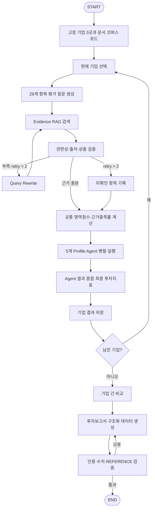

# 배터리 분석 AI 스타트업 투자평가 Agentic RAG

> **SKALA 4기 · 울산 3반 · 4조**
> 팀원: 김대훈 · 강도희 · 이연주 · 정수민 · 손연우

LangGraph 기반 다중 에이전트(Multi-Agent)와 Agentic RAG를 활용하여, 배터리 분석 AI 스타트업의 비정형 문서를 수집·검증하고 **5가지 서로 다른 투자 관점**으로 병렬 평가한 뒤 최종 투자 검토 보고서를 자동 생성하는 파이프라인입니다.

---

## 목차

1. [도메인과 문제 정의](#1-도메인과-문제-정의)
2. [시스템 설계 원칙](#2-시스템-설계-원칙)
3. [Evidence RAG 전략](#3-evidence-rag-전략)
4. [공통 평가 기준과 점수 산식](#4-공통-평가-기준과-점수-산식)
5. [5개 Profile Agent](#5-5개-profile-agent)
6. [Graph 전체 흐름](#6-graph-전체-흐름)
7. [State Schema](#7-state-schema)
8. [프로젝트 구조](#8-프로젝트-구조)
9. [설치 및 실행 방법](#9-설치-및-실행-방법)
10. [실행 예시](#10-실행-예시)
11. [출력 보고서 예시](#11-출력-보고서-예시)
12. [구현·검증 계획과 담당](#12-구현검증-계획과-담당)

---

## 1. 도메인과 문제 정의

| 항목 | 내용 |
|---|---|
| **대분류** | Energy |
| **세부 분야** | Battery Intelligence · BMS · ESS 분석 AI |
| **분석 대상** | ACCURE Battery Intelligence, volytica diagnostics, Electra Vehicles |

**문제 인식**: 투자자는 배터리 AI 스타트업의 핵심 기술(SOC·SOH·RUL·열화 예측 등), 실제 성능, 고객 실적을 평가해야 하나, 기업마다 공개 지표와 시험 조건이 다르고 자체 주장과 독립 검증이 혼재되어 **직접 비교가 매우 어렵습니다.**

**해결책**: 단순 검색이나 LLM 요약이 아닌, 사실(Evidence) 수집과 투자 성향(Investment Profile) 판단을 **완벽히 분리**하여 다수결 합의 및 이견 분석을 수행하는 의사결정 시스템을 구축합니다.

---

## 2. 시스템 설계 원칙

시스템은 **공통 근거를 만드는 Evidence RAG Subgraph**와, 동일한 근거를 바탕으로 각기 다른 가중치와 투자 철학으로 해석하는 **5개의 Profile Agent**로 구성됩니다.

| 단계 | 동작 | 산출물 |
|---|---|---|
| 1. 고정 입력 | ACCURE·volytica·Electra와 선별 문서 로드 | `current_company` · `source metadata` |
| 2. Evidence RAG | 29개 항목 질문화 → 검색 → 근거 검증 → 재검색 | `validated_evidence` · `unknown_items` |
| 3. 공통 평가 | 동일 평가표로 영역점수와 근거 충족률 계산 | `domain_scores` · `evidence_coverage` |
| 4. Profile Agent | 5개 성향이 서로 다른 가중치로 병렬 판단 | 5개 `AgentResult` |
| 5. 종합 | 평균·편차·합의·소수의견·추가실사 결합 | `FinalInvestmentIndex` |
| 6. 기업 반복 | 3개 기업 결과 저장 후 다음 기업 처리 | `company_results` |
| 7. 보고서 | 기업 간 비교와 실제 사용 출처 정리 | 5쪽 이내 마크다운 보고서 |

**에이전트 설계 원칙**
- 각 Agent는 자유 문장이 아니라 **공통 Pydantic 스키마**로 결과를 반환한다.
- 모든 핵심 판단은 `evidence_id`와 원문 근거 문장에 연결한다.
- 자료가 없으면 낮은 점수를 **추정하지 않고** `unknown`으로 기록한다.
- 기업 자체 주장과 독립 자료를 구분하고, 시험 조건이 다른 성능 수치를 직접 비교하지 않는다.
- 투자금액·매출·고객 수·성능 수치를 **LLM이 추정해 만들지 못하게** 한다.

---

## 3. Evidence RAG 전략

### 3-1. 문서 설계

| 문서 유형 | 예상 분량 | 활용 목적 |
|---|---|---|
| 기업 공식 기술자료·백서 | 40쪽 | 제품·기술 원리·입출력·성능 주장 |
| 고객 사례·보도자료 | 30쪽 | 도입 실적·고객 효과·계약 신호 |
| 논문·특허·외부 검증 | 50쪽 | 기술 타당성·IP·한계 검증 |
| 시장·안전·규제 자료 | 50쪽 | 시장성·표준·법적 책임 |
| 투자·기업 현황 | 20쪽 | 투자단계·팀·재무 신호 |
| **합계** | **최대 200쪽** | 3개 기업 공통 코퍼스 |

### 3-2. Embedding 모델

1차 선정 모델: **`BAAI/bge-m3`**
- 한국어 평가 질문으로 영어·독일어 논문·특허·기업자료를 검색해야 하므로 **다국어 혼합 검색**이 필수
- Dense·Sparse·Multi-vector를 지원하여 **하이브리드 검색 확장**에 유리
- 최대 8,192 tokens 입력으로 긴 기술 문단 처리 가능
- 공개 리더보드가 아니라 실제 **45문항 평가셋 결과**로 최종 확정

### 3-3. 청킹·검색 전략
- 제목·소제목·표 제목을 chunk 본문에 포함하고 페이지 번호를 유지
- 표는 행과 열 의미가 사라지지 않도록 헤더를 각 chunk에 반복
- 초기 **Top-K는 5**로 설정하고, 동일 문서 chunk 독점을 막기 위해 문서 다양성 적용
- 회사명·제품명·SOC·SOH·RUL·UL 9540A 등 정확 키워드는 metadata filter와 hybrid 검색 후보로 사용

### 3-4. 근거 등급 체계 (Evidence Grade)

| 등급 | 자료 유형 | 사용 원칙 |
|---|---|---|
| **A** | 규제기관·법원·특허청·공시·인증기관·동료평가 논문·독립 고객 원문 | 사실 확인의 주근거 |
| **B** | 회사 공식 제품문서·투자사 발표·실명 고객 사례 | 구체 조건 확인 후 보조근거 |
| **C** | 회사 홈페이지·보도자료·인터뷰·조건이 부족한 자체 주장 | 주장 존재 확인, 단독 고득점 제한 |
| **U** | 출처 불명·검색 스니펫·확인 불가·해결되지 않은 상충 | 점수근거 제외·unknown |

### 3-5. 재검색(Query Rewrite) 조건
- 검색 결과가 평가 질문과 직접 관련되지 않는다
- 회사 주장만 있고 독립적인 확인 자료가 없다
- 성능 수치에 표본·화학계·시험환경·오차 정의가 없다
- 고객 도입과 단순 파트너십을 구분할 수 없다
- 출처 간 날짜·금액·성능·회사 상태가 상충한다

---

## 4. 공통 평가 기준과 점수 산식

### 4-1. 5대 평가 영역

| 영역 | 주요 평가 질문 | 공통 산출 |
|---|---|---|
| 기술 경쟁력 | AI 모델·입력데이터·SOC/SOH/RUL·성능조건·실시간성·BMS/ESS·특허·현장확장 | 0~100 기술점수 |
| 시장성 | 고객문제·시장규모·경쟁구도·지역/세그먼트 확장·지불의사 | 0~100 시장점수 |
| 재무·고객 실적 | 투자단계·매출·유료고객·파일럿·계약·반복매출·수익모델 | 0~100 재무점수 |
| 안정성 | 안전·규제·제조물책임·데이터 권리·재무연속성·주장 상충 | 0~100 안정성점수 |
| 팀·사업 실행력 | 창업진 경험·기술/영업 균형·제품출시·파트너십·설치/운영 확장 | 0~100 실행점수 |

### 4-2. 공통 점수 척도 (1~5)

| 점수 | 판단 기준 |
|---|---|
| **5** | 독립적이고 구체적인 근거로 우수성이 확인됨 |
| **4** | 구체적 근거가 있으나 일부 제한 또는 미확인 사항이 존재함 |
| **3** | 기본 역량은 확인되지만 차별성이나 성과 근거가 제한적임 |
| **2** | 회사 주장은 있으나 외부 검증 또는 상용 실적이 부족함 |
| **1** | 핵심 역량의 근거가 거의 없거나 중대한 약점이 확인됨 |
| **미확인** | 필요한 공개자료가 없음. **0점으로 환산하지 않고** 근거 충족률에만 반영 |

### 4-3. 점수 계산 산식

```
세부항목 점수       = 1~5점 또는 미확인
DomainScore(d)     = 확인된 항목의 가중평균 × 20
ProfileScore(p)    = Σ[ DomainScore(d) × ProfileWeight(p,d) ]
FinalInvestmentIndex = mean(5개 ProfileScore)
ViewpointDispersion  = stdev(5개 ProfileScore)
EvidenceCoverage     = 확인된 세부항목 수 / 전체 세부항목 수 × 100
```

### 4-4. 최종 판정 기준

| 조건 | 기본 판정 | 출력 원칙 |
|---|---|---|
| 최종지표 ≥ 75점 · 근거충족률 ≥ 80% | **투자검토 추천** | 핵심 근거와 미확인 항목 병기 |
| 최종지표 60~74점 또는 근거충족률 60~79% | **조건부 검토** | 충족해야 할 실사조건 제시 |
| 최종지표 < 60점 | **보류** | 낮은 점수의 근거와 개선조건 제시 |
| 근거충족률 < 60% | **판단 유보** | 점수보다 데이터룸 요청을 우선 |

---

## 5. 5개 Profile Agent

다섯 Agent는 같은 **공통 영역점수**를 입력받고 투자 성향에 따라 **가중치만 달리**합니다.

| 담당 | Agent | 핵심 책임 | 기술 | 시장 | 재무 | 안정성 | 팀·사업 |
|---|---|---|---|---|---|---|---|
| 손연우 | **기술중심형** | 모델·데이터·BMS/ESS 연동·특허·현장확장성 | **35%** | 20% | 10% | 15% | 20% |
| 강도희 | **안정형** | 투자단계·재무연속성·안전·규제·데이터 권리 | 15% | 15% | **30%** | **30%** | 10% |
| 김대훈 | **성장형** | AI 확장성·시장성장·고객확대·제품 확장 가능성 | 20% | **35%** | 15% | 10% | 20% |
| 이연주 | **균형형** | 기술·시장·재무·안정·사업을 동일 비중으로 해석하고 편향 점검 | 20% | 20% | 20% | 20% | 20% |
| 정수민 | **사업성중심형** | 수익모델·고객·계약·팀·실행력·통계 타당성 | 15% | 25% | 20% | 10% | **30%** |

**공통 AgentResult 스키마**

| 필드 | 설명 |
|---|---|
| `profile_name` | 기술·안정·성장·균형·사업 중 하나 |
| `weighted_score` | 해당 Profile 가중치를 적용한 0~100점 |
| `domain_contributions` | 영역별 점수·가중치·기여점수 |
| `supporting_evidence_ids` | 찬성 근거 ID |
| `contrary_evidence_ids` | 반대·상충 근거 ID |
| `unknown_items` | 공개자료로 확인하지 못한 항목 |
| `recommendation` | 추천·조건부 검토·보류 |
| `due_diligence_questions` | 투자 전 추가 확인 질문 |

---

## 6. Graph 전체 흐름



| 구조 | 설계 내용 | 종료·통제 |
|---|---|---|
| Workflow | 고정입력→질문→검색→검증→점수→5 Agent→종합→기업반복→보고서 | 모든 기업 처리 후 보고서 단계 |
| Retrieval Loop | 근거 부족이면 Query Rewrite 후 retrieve로 복귀 | 질문별 최대 2회 |
| Unknown Branch | 재검색 한도 도달 시 미확인으로 기록하고 계속 | 환각·임의 점수 금지 |
| Profile Fan-out | 동일 `domain_scores`·`validated_evidence`를 5개 Agent에 Send | Reducer가 5개 결과를 모두 수신 |
| Company Loop | `company_result` 저장 후 `current_index` 증가 | 3개 완료 시 `compare_companies` |
| Report Loop | 인용 누락·수치 불일치·REFERENCE 오류면 보고서 재생성 | 오류 0이면 END |

---

## 7. State Schema

```python
class InvestmentAgentState(TypedDict):
    selected_companies: List[Company]          # 사전 선정 완료된 3개 기업
    current_index: int                         # 현재 기업 위치
    current_company: Optional[Company]         # 현재 분석 기업
    evaluation_questions: List[Question]       # 29개 항목 기반 평가 질문
    retrieved_evidence: List[Evidence]         # Top-K 검색 결과
    validated_evidence: List[Evidence]         # 근거검증 통과 결과
    evidence_coverage: float                   # 질문·항목 근거 충족률
    retry_count: Dict[str, int]               # 질문별 재검색 횟수
    unknown_items: List[str]                   # 재검색 후 미확인 항목
    domain_scores: Dict[Domain, float]        # 공통 5개 영역 점수
    profile_results: Annotated[List, add]     # 병렬 5개 Agent 결과 (Reducer)
    company_result: Optional[CompanyResult]    # 현재 기업 종합결과
    company_results: Annotated[List, add]     # 3개 기업 결과 누적 (Reducer)
    final_comparison: Optional[ComparisonResult] # 기업 간 비교·최종지표
    report_draft: str                          # 5쪽 보고서 작성용 내용
    report_errors: List[str]                   # 인용·수치·형식 검증 오류
```

> **State 설계 원칙**
> - 노드는 State 전체가 아니라 자신이 담당한 key만 부분 업데이트한다.
> - `profile_results`와 `company_results`는 **Reducer**를 사용해 병렬·반복 결과를 누적한다.
> - 질문별 `retry_count`로 재검색 상한을 제어하고 2회 후에는 unknown으로 종료한다.

---

## 8. 프로젝트 구조

```
capstone-v1/
├── main.py                    # 파이프라인 진입점 (환경점검 → GUI 파일선택 → 실행 → 보고서 자동 열기)
├── src/
│   ├── schemas.py             # Pydantic 모델 (Company, Evidence, ProfileResult, State 등)
│   ├── graph.py               # LangGraph 그래프 정의 (노드·엣지·조건부 분기·Send)
│   ├── nodes/
│   │   └── core.py            # 핵심 노드 함수 (load_inputs ~ generate_report)
│   ├── agents/
│   │   └── profile.py         # 5개 Profile Agent 노드 (LLM + Structured Output)
│   └── rag/
│       ├── ingest.py          # PDF 파싱 → 청킹 → FAISS 인덱스 구축
│       └── vector_store.py    # FAISS 벡터 검색 (retrieve_top_k)
├── configs/
│   └── profiles.yaml          # 5개 에이전트 가중치·성향 설정
├── data/
│   ├── raw/                   # 분석할 기업 문서 (PDF, TXT, DOCX)
│   └── processed/             # FAISS 인덱스 저장소
├── output/                    # 자동 생성된 투자 보고서
├── tests/                     # 단위 테스트
└── pyproject.toml             # 의존성 관리 (uv)
```

---

## 9. 설치 및 실행 방법

### Step 1. 환경 변수 설정
프로젝트 루트에 `.env` 파일을 생성하고 API 키를 입력합니다.
```env
OPENAI_API_KEY=sk-...
LANGCHAIN_TRACING_V2=true
LANGCHAIN_PROJECT=SKALA
```

### Step 2. 실행
```bash
uv run python main.py
```

실행하면 아래 4단계가 **자동으로** 순서대로 진행됩니다.

1. **환경 점검** — OpenAI API 연결과 LangSmith 설정을 자동 확인합니다. 실패 시 원인을 알려주고 안전하게 종료합니다.
2. **파일 선택** — macOS 기본 파일 선택 창(GUI)이 팝업됩니다. 분석할 기업의 PDF/TXT 파일을 마우스로 선택하면 `data/raw/`로 자동 복사됩니다. (기존 파일이 있으면 그대로 사용할지 물어봅니다.)
3. **Multi-Agent 파이프라인 구동** — 문서 임베딩 → 5대 영역 평가 → 5개 에이전트 병렬 분석 → 기업 비교 → 보고서 생성이 자동으로 진행됩니다.
4. **보고서 자동 열기** — 완료 즉시 생성된 마크다운 보고서 파일이 화면에 열립니다.

---

## 10. 실행 예시

`uv run python main.py`를 실행하면 터미널에 다음과 같은 대시보드가 출력됩니다.

```text
╭────────────────────────────────────────────────────╮
│ 배터리 스타트업 투자평가 Multi-Agent 파이프라인 🚀 │
╰────────────────────────────────────────────────────╯

🔍 1단계: API 및 환경 변수 점검
  ✔ OpenAI API 연결 성공
  ✔ LangSmith 트레이싱 활성화 (프로젝트: SKALA)
=> 환경 점검 완료!

📂 2단계: 분석 대상 문서 로드
기존 data/raw 폴더에 파일이 있습니다. 새로 파일을 선택하시겠습니까? [y/n]: n
✔ 기존 폴더의 파일을 그대로 사용합니다.

🧠 3단계: 문서 스캔 및 지식 베이스 구축
📄 읽은 파일: ACCURE_RAG_source_pack.pdf (기업명: ACCURE) - 6 페이지/섹션
✂️ 청킹 완료: 총 14 개의 청크 생성 (크기: 500, 오버랩: 50)
🧠 OpenAI 임베딩 및 FAISS DB 생성 중...
✅ DB 저장 완료!
✔ 문서 임베딩 완료

🤖 4단계: Multi-Agent 투자 심사 진행
 ➔ 📂 분석 타겟: ACCURE

🎯 타겟 기업 설정됨: ACCURE
 ➔ ✨ Sub-Agent 작업 완료: build_questions
 ➔ ✨ Sub-Agent 작업 완료: retrieve_evidence
 ➔ ✨ Sub-Agent 작업 완료: score_common
 ➔ 👥 5대 프로필 에이전트 병렬(Parallel) 분석 완료
 ➔ 👥 5대 프로필 에이전트 병렬(Parallel) 분석 완료
 ➔ 👥 5대 프로필 에이전트 병렬(Parallel) 분석 완료
 ➔ 👥 5대 프로필 에이전트 병렬(Parallel) 분석 완료
 ➔ 👥 5대 프로필 에이전트 병렬(Parallel) 분석 완료
 ➔ ⚖️ 최종 투자 판정: 투자검토 추천 (84.1점)
 ➔ 📊 기업 비교 및 최종 테이블 작성 완료
 ➔ 📑 투자 심사 마크다운 보고서 생성 완료
⠇ Multi-Agent 파이프라인 실행 완료!

==================================================
╭──────────────────────────────────────────────────────────────────────────────╮
│ ✅ 파이프라인 실행 완료                                                      │
│ 최종 투자 심사 보고서가 final_multi_agent_report.md에 저장되었습니다.        │
╰──────────────────────────────────────────────────────────────────────────────╯

📄 생성된 투자 보고서를 자동으로 엽니다...
```

---

## 11. 출력 보고서 예시

파이프라인이 완료되면 `output/final_multi_agent_report.md`에 다음과 같은 보고서가 자동 생성됩니다.

```markdown
# 투자 심사 요약 보고서 (Multi-Agent RAG)

## 1. 종합 비교표
| 기업 | 기술 | 시장 | 재무 | 안정성 | 팀·사업 | 근거충족률 | 최종 점수 | 판정 |
|---|---|---|---|---|---|---|---|---|
| ACCURE | 90.0 | 80.0 | 70.0 | 84.0 | 96.0 | 85.0% | 84.1 | 투자검토 추천 |

## 2. 기업별 상세
### ACCURE (투자검토 추천)
- **평균 점수**: 84.1점 (표준편차: 1.6)
- **근거 충족률**: 85.0%

#### Profile Agent 결과
- **기술중심형 (손연우)**: 86.3점 — 배터리 관리 솔루션에서 뛰어난 기술력을 보유하며 
  BMS/ESS 연동의 기술적 타당성이 매우 높음. (강력 추천)
- **사업성중심형 (정수민)**: 84.7점 — 팀의 경험과 배경이 강력하여 뛰어난 사업 실행력이 
  기대됨. (추천)
- **성장형 (김대훈)**: 84.1점 — 배터리 분석 시장에서의 성장 가능성이 높음. (추천)
- **균형형 (이연주)**: 84.0점 — 기술력과 시장 입지는 양호하나 재무적 측면 보완 필요. 
  (조건부 추천)
- **안정형 (강도희)**: 81.3점 — 기술은 훌륭하나 재무적 안정성과 고객 실적의 독립적 
  검증이 부족함. (추가 실사 요망)
```

> **Insight**: 기술중심형 에이전트는 `86.3점`의 고득점을 부여한 반면, 재무와 데이터 출처를 엄격하게 따지는 안정형 에이전트는 `81.3점`이라는 가장 낮은 점수를 부여했습니다. 이처럼 의도된 **"관점의 충돌"**을 통해 투자 리스크를 다각도에서 검증하는 것이 본 시스템의 핵심입니다.

---

## 12. 구현·검증 계획과 담당

| 단계 | 구현 내용 | 완료 조건 |
|---|---|---|
| 1. 데이터 | 63개 출처에서 200쪽 이하 문서 선별·파싱·metadata 부착 | `source_id`·`page`·`source_type` 추적 가능 |
| 2. Retrieval | bge-m3/e5 인덱스와 45문항 평가 | Hit@5·MRR@5·지연시간 비교 |
| 3. Evidence RAG | retrieve·validate·rewrite·unknown 노드 | 재검색 2회 종료·인용 연결 |
| 4. Scoring | 공통점수·근거충족률·가중치 계산 | 단위테스트 계산오차 0 |
| 5. Agents | 5개 ProfileConfig와 병렬 fan-out | 스키마 준수·5개 결과 reducer |
| 6. Synthesis | 평균·표준편차·합의·이견·추가실사 | 3개 기업 비교 가능 |
| 7. Report | 5쪽 보고서 구조화·인용 검증 | REFERENCE 역참조·형식 오류 0 |

**구성원 담당**

| 구성원 | Agent 담당 | 구현·검증 산출물 |
|---|---|---|
| 손연우 | 기술중심형 | 기술·연동 평가항목, BMS/ESS 구조, 기술 Agent 테스트 |
| 강도희 | 안정형 | 투자단계·법률·안전·데이터 권리 근거, 안정 Agent 테스트 |
| 김대훈 | 성장형 | AI 모델·데이터·성능·확장성, 성장 Agent 테스트 |
| 이연주 | 균형형 | 열화·화학계·실운용 타당성, 공통 기준·편차 검증 |
| 정수민 | 사업성중심형 | Scorecard·시장·고객·통계·45문항 평가셋 |

---

**설계 범위와 한계**
- 본 시스템은 공개문서 기반 투자검토 보조도구이며 실제 투자·법률·안전 실사를 대체하지 않는다.
- 비공개 매출·고객계약·모델데이터는 unknown으로 남기고 데이터룸 요청으로 연결한다.
- Embedding 선정과 Agent 임계값은 설계 가설이며 실제 평가 결과로 보정한다.
