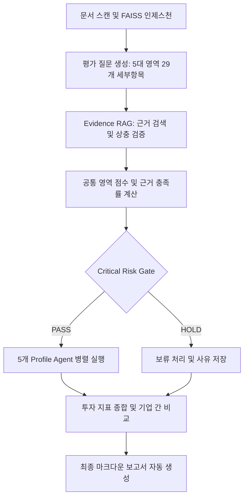

# 배터리 분석 AI 스타트업 투자평가 Multi-Agent RAG

> LangGraph 기반 다중 에이전트(Multi-Agent)와 Agentic RAG를 활용하여, 배터리 분석 AI 스타트업의 비정형 문서를 수집/검증하고 5가지 서로 다른 투자 관점(Profile)으로 병렬 평가하여 최종 투자 검토 보고서를 자동 생성하는 AI 파이프라인입니다.

## 🌟 프로젝트 소개 및 핵심 기술 (Our Technology)

본 프로젝트는 단순한 RAG(Retrieval-Augmented Generation) 챗봇이나 단일 LLM 요약기가 아닙니다. **사실 분석(Fact-checking)과 투자 성향(Investment Profile)을 완벽히 분리**한 **다중 에이전트 기반 의사결정 시스템(Multi-Agent Decision System)**입니다.

### 1. 객관적 근거 수집 (Agentic RAG)
- **Top-K 문서 검색 및 검증**: OpenAI `text-embedding-3-small` 기반 FAISS 인덱스를 활용하여 기업의 공식 백서, 논문, 기사에서 핵심 근거를 수집합니다.
- **환각(Hallucination) 방지**: LLM이 데이터를 추정(Guessing)하지 못하게 하며, 모든 판단은 `source_id`를 갖춘 문서 내 실제 문장(Evidence)에 기반합니다. 정보가 없으면 임의의 낮은 점수를 주지 않고 "미확인(Unknown)"으로 분류해 근거 충족률(`Evidence Coverage`)을 낮춥니다.

### 2. 다중 페르소나 병렬 평가 (Multi-Agent Parallel Evaluation)
- 수집된 객관적 사실(Common Evidence)을 5명의 각기 다른 투자 심사역 에이전트에게 전달합니다.
- **5개 Profile Agent**: `기술중심형`, `안정형`, `성장형`, `균형형`, `사업성중심형`
- 동일한 사실을 보더라도, 각 에이전트는 설정된 **투자 철학 가중치(Weight)**에 따라 점수를 다르게 산정합니다. (예: 기술력은 높지만 재무가 불안정한 기업은 '기술중심형' 에이전트에게는 고득점을, '안정형' 에이전트에게는 저득점을 받습니다.)

### 3. 최종 의견 조율 및 보고서 작성 (Consensus & Synthesis)
- 에이전트 간의 평가 편차(Standard Deviation)를 분석하여 의견 차이(Disagreement)를 포착하고, 만장일치 강점과 리스크를 종합하여 5쪽 이내의 투자 심사 보고서를 마크다운으로 자동 발행합니다.

---

## ⚙️ 작동 프로세스 (Workflow)



1. **`score_common`**: 기술, 시장, 재무, 리스크, 팀의 5대 영역에서 확보된 근거에 따라 1~5점 가중평균 산식을 돌려 **객관적 공통 점수**를 도출합니다.
2. **`critical_risk_gate`**: 점수가 현저히 미달(60점 이하)이거나 데이터 권리 등 치명적 리스크가 있으면 즉시 **HOLD** 처리합니다.
3. **`profile_agent`**: LangGraph의 `Send` API를 이용해 5개의 에이전트를 동시에(Parallel) 띄웁니다. 이들은 각자의 가중치를 곱해 100점 만점 기준의 최종 환산 점수와 찬/반 근거를 반환합니다.

---

## 💻 설치 및 코드 실행 예시

### 1. 환경 변수 설정
프로젝트 루트 경로에 `.env` 파일을 생성하고 OpenAI API 키를 입력합니다.
```env
OPENAI_API_KEY=sk-...
```

### 2. 분석 데이터 준비
평가하고자 하는 기업의 실제 문서(PDF, DOCX, TXT)를 `data/raw/` 폴더에 넣습니다. (예: `ACCURE_RAG_source_pack.pdf`)

### 3. 파이프라인 실행
터미널에서 아래 명령어를 실행하면, **문서 임베딩 ➔ 그래프 구동 ➔ 최종 보고서 생성**이 전자동으로 진행됩니다.

```bash
uv run python main.py
```

### 4. 코드 실행 콘솔 예시 (Rich Dashboard)
코드가 구동되면 다음과 같은 진행 상황이 콘솔에 직관적으로 표시됩니다.
```text
╭────────────────────────────────────────────────────╮
│ 배터리 스타트업 투자평가 Multi-Agent 파이프라인 🚀 │
╰────────────────────────────────────────────────────╯
데이터 스캔 시작... (경로: /Users/skala100/pjt/capstone-v1/data/raw)
📄 읽은 파일: ACCURE_RAG_source_pack.pdf (기업명: ACCURE) - 6 페이지/섹션
✂️ 청킹 완료: 총 14 개의 청크 생성 (크기: 500, 오버랩: 50)
🧠 OpenAI 임베딩 및 FAISS DB 생성 중...
✅ DB 저장 완료!
✔ 문서 임베딩 완료                  

 ➔ 📂 분석 대상: ACCURE
🎯 타겟 기업 설정됨: ACCURE
 ➔ ✨ 노드 완료: build_questions
 ➔ ✨ 노드 완료: retrieve_evidence
 ➔ ✨ 노드 완료: validate_evidence
 ➔ ✨ 노드 완료: score_common
 ➔ 👥 프로필 에이전트 병렬 분석 완료 (x 5)
 ➔ ⚖️ 투자 판정: 투자검토 추천 (84.1점)
 ➔ 📊 기업 비교 및 최종 테이블 작성 완료
 ➔ 📑 최종 마크다운 보고서 생성 완료
⠼ 파이프라인 실행 완료!
```

---

## 📊 결과 보고서 예시 (`output/final_multi_agent_report.md`)

LangGraph 파이프라인 실행이 완료되면 다음과 같은 인사이트가 담긴 마크다운 보고서가 생성됩니다.

```markdown
# 투자 심사 요약 보고서 (Multi-Agent RAG)

## 1. 종합 비교표
| 기업 | 기술 | 시장 | 재무 | 안정성 | 팀·사업 | 근거충족률 | 최종 점수 | 판정 |
|---|---|---|---|---|---|---|---|---|
| ACCURE | 90.0 | 80.0 | 70.0 | 84.0 | 96.0 | 85.0% | 84.1 | 투자검토 추천 |

## 2. 기업별 상세
### ACCURE (투자검토 추천)
- **평균 점수**: 84.1점 (표준편차: 1.6)
- **근거 충족률**: 85.0%
- **최종 요약**: 다수 프로필 종합 결과, 평균 84.1점 (편차 1.6)

#### Profile Agent 결과
- **기술중심형**: 86.3점 - ACCURE는 배터리 관리 솔루션에서 뛰어난 기술력을 보유... (강력 추천)
- **사업성중심형**: 84.7점 - 팀의 경험과 배경이 강력하여 뛰어난 사업 실행력이 기대됨... (추천)
- **성장형**: 84.1점 - 배터리 분석 시장에서의 성장 가능성이 높음... (추천)
- **균형형**: 84.0점 - 기술력과 시장 입지는 양호하나 재무적 측면 보완 필요... (조건부 추천)
- **안정형**: 81.3점 - 기술은 훌륭하나 **재무적 안정성과 고객 실적의 독립적 검증이 부족**함. 고객 기반 확장을 통한 추가 현금 흐름 실사가 필요함... (조건부 보류)
```

> **Insight**: 위 예시를 보면, 배터리 AI 솔루션의 강력한 기술력 덕분에 '기술중심형' 에이전트는 `86.3점`이라는 가장 높은 점수를 부여한 반면, 까다로운 '안정형' 에이전트는 재무 데이터의 불확실성을 꼬집으며 `81.3점`으로 가장 낮은 점수를 주었습니다. 이처럼 각기 다른 전문 분야의 심사역이 모여 토론하는 듯한 입체적인 평가를 제공하는 것이 본 파이프라인의 핵심입니다.

---

*본 프로젝트는 LangChain과 LangGraph를 활용하여 RAG 기반의 복잡한 의사결정 프로세스를 Multi-Agent 시스템으로 완벽히 구현한 실전 레퍼런스입니다.*
