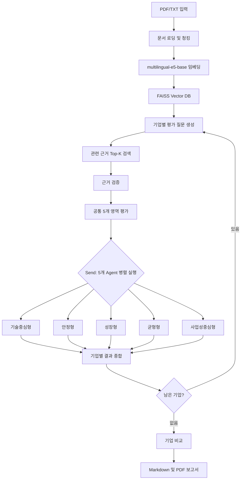

# Battery Intelligence 스타트업 투자평가 Multi-Agent RAG

> SKALA 4기 · 울산 3반 · 4조  
> LangGraph 기반 Multi-Agent + Agentic RAG 투자평가 시스템

## 1. 프로젝트 한 줄 소개

배터리 AI 스타트업의 공개자료를 RAG로 검색하고, 동일한 근거를 **기술·안정·성장·균형·사업성의 5개 투자 관점**으로 병렬 평가하여 근거 기반 투자보고서를 생성합니다.

이 프로젝트의 핵심은 단순히 LLM에게 투자 여부를 질문하는 것이 아닙니다.

1. 평가에 사용할 근거를 먼저 수집합니다.
2. 공통 기준과 투자자 유형별 기준을 분리해 평가합니다.
3. 근거가 부족하면 억지로 점수를 만들지 않고 `판단 유보`로 남깁니다.
4. 최종 결과를 5페이지 이내의 차트 포함 PDF로 출력합니다.

---

## 2. 문제 정의

배터리 AI 기업은 다음과 같은 이유로 직접 비교하기 어렵습니다.

- SOC·SOH·RUL 등 기업마다 제시하는 기술지표가 다릅니다.
- 같은 정확도라도 시험 조건, 배터리 화학계, 데이터 규모가 다릅니다.
- 회사의 홍보자료와 독립 검증자료가 함께 검색됩니다.
- 매출, 계약, 고객 유지율처럼 비상장기업이 공개하지 않는 정보가 많습니다.
- 기술력이 높더라도 안정성 또는 사업성이 부족할 수 있습니다.

따라서 하나의 종합 프롬프트가 모든 판단을 수행하면 관점이 섞이고, 공개되지 않은 정보를 추정할 위험이 있습니다. 이를 해결하기 위해 **근거 수집과 투자 판단을 분리**하고, 투자 판단을 다시 **5개 전문 Agent**로 분할했습니다.

---

## 3. 핵심 차별점

### 차별점 1. 하나의 점수가 아니라 5개의 투자 관점

모든 Agent가 같은 근거를 사용하지만 중요하게 보는 기준은 다릅니다.

| Agent | 핵심 관점 | 주요 확인 내용 |
|---|---|---|
| 기술중심형 | 기술의 실제 검증 수준 | 예측 성능, 독립 검증, 데이터 경쟁력, BMS/ESS 연동, 일반화, 기술 방어력 |
| 안정형 | 손실 가능성과 지속 가능성 | 안전·규제, 재무 지속성, 데이터 이용 권한, 제조물책임 |
| 성장형 | 성장 속도와 확장 가능성 | 시장 성장률, 유료 전환, ARR 성장, 확장성, 데이터 네트워크 효과 |
| 균형형 | 영역 간 연결성 | 기술-시장 적합성, 시장-수익 전환성, 기술-리스크 양립성, 팀-사업 실행력 |
| 사업성중심형 | 실제 돈을 버는 구조 | 수익모델, 고객·계약, 상용화, 팀의 사업 실행력 |

이 구조를 통해 “기술은 좋지만 수익모델이 약한 기업”과 “성장은 빠르지만 안전·규제 위험이 큰 기업”을 서로 다른 관점으로 설명할 수 있습니다.

### 차별점 2. 공통 평가 70% + 유형별 독립 평가 30%

각 Agent의 최종점수는 다음 구조를 사용합니다.

```text
공통 프로필 점수 = Σ(기술·시장·재무·리스크·팀 점수 × Agent별 영역 가중치)

Agent 최종점수 = 공통 프로필 점수 × 70%
                + Agent별 독립 세부점수 × 30%
```

- **공통 70%**는 모든 Agent가 기업의 기본적인 투자 매력을 같은 틀에서 평가하게 합니다.
- **유형별 30%**는 각 Agent의 목적에 맞는 별도 파라미터로 계산합니다.
- 유형별 30%는 공통 점수를 다시 복사하거나 재가중한 값이 아니라, 각 관점에 맞게 독립적으로 평가합니다.

예를 들어 성장형 Agent의 30%는 시장 성장, 고객 전환, 매출 성장, 확장성, 데이터 네트워크 효과, 실행역량으로 구성됩니다. 기술형 Agent는 예측 성능과 검증 신뢰성을 중심으로 별도의 기술 점수를 만듭니다.

### 차별점 3. 근거 부족을 0점으로 처리하지 않음

공개자료가 없다는 것은 성과가 나쁘다는 뜻이 아닙니다. 따라서 미확인 항목을 0점으로 바꾸지 않습니다.

| 근거 상태 | 처리 방식 |
|---|---|
| 충분한 직접 근거 | 항목 평가 및 점수 산출 |
| 일부 근거만 확인 | 항목별 상태 기록, 종합점수 산출 조건 확인 |
| 핵심 지표 미확인 | `weighted_score=None`, 판단 유보 |
| 평가 대상이 아님 | `NOT_APPLICABLE`, 충족률 분모에서 제외 |
| 상충 근거 존재 | 반대 근거로 기록하고 추가 실사 요청 |

판단 유보가 발생해도 Graph를 중단하지 않습니다. 해당 Agent의 점수는 미산출로 유지하고, 부족한 근거와 추가 실사 질문을 최종 보고서의 **근거 부족 및 판단 유보** 항목에 표시합니다.

---

## 4. 전체 시스템 구조



### 기술별 역할

| 기술 | 역할 |
|---|---|
| LangChain | 문서 로딩, 청킹, 임베딩, FAISS 검색, 프롬프트 및 구조화 출력 |
| LangGraph | State 관리, 실행 순서, 조건 분기, 기업 반복, 5개 Agent 병렬 실행 |
| Pydantic | Evidence, ProfileResult, CompanyResult 등 결과 스키마 검증 |
| FAISS | 평가 질문과 관련된 문서 청크 검색 |
| ReportLab / WeasyPrint | 차트 및 PDF 투자보고서 출력 |

### 실제 코드로 보는 LangChain

#### 1. 문서 로딩과 청킹

[`src/rag/ingest.py`](src/rag/ingest.py)에서 LangChain Loader로 PDF/TXT를 읽고 `RecursiveCharacterTextSplitter`로 검색 단위를 만듭니다.

```python
if file.suffix.lower() == ".pdf":
    loader = PyPDFLoader(str(file))
elif file.suffix.lower() == ".txt":
    loader = TextLoader(str(file), encoding="utf-8")

loaded_docs = loader.load()

text_splitter = RecursiveCharacterTextSplitter(
    chunk_size=500,
    chunk_overlap=50,
    separators=["\n\n", "\n", ".", " ", ""],
)
split_docs = text_splitter.split_documents(docs)
```

발표 포인트는 “PDF 전체를 LLM에 넣는 것이 아니라, 의미 검색이 가능한 500자 단위 청크로 나눈다”는 것입니다. 50자 overlap은 청크 경계에서 문맥이 끊기는 문제를 줄입니다.

#### 2. 임베딩과 FAISS 검색

[`src/rag/vector_store.py`](src/rag/vector_store.py)에서 다국어 E5 임베딩을 만들고, 질문과 의미적으로 가까운 문서를 검색합니다.

```python
def get_embeddings():
    return HuggingFaceEmbeddings(
        model_name="intfloat/multilingual-e5-base",
        model_kwargs={"device": "cpu"},
        encode_kwargs={"normalize_embeddings": True},
    )

results = db.similarity_search_with_score(query, k=k)
```

단순 키워드 일치가 아니라 질문과 청크를 벡터로 변환해 의미적으로 가까운 근거를 가져옵니다. 검색 결과는 이후 Agent가 사용하는 `Evidence` 객체로 변환됩니다.

#### 3. 프롬프트와 구조화 출력

성장형 Agent는 LangChain의 `ChatPromptTemplate`과 Pydantic 구조화 출력을 연결합니다.

```python
growth_scoring_llm = llm.with_structured_output(GrowthCustomEvaluation)

growth_scoring_prompt = ChatPromptTemplate.from_messages([
    ("system", "제공된 검증 근거만 사용해 성장형 지표를 평가하세요."),
    ("user", "기업명: {company_name}\n근거: {evidence_text}"),
])

growth_evaluation = (
    growth_scoring_prompt | growth_scoring_llm
).invoke({
    "company_name": company_name,
    "evidence_text": evidence_text,
})
```

`prompt | llm`은 LangChain Runnable 파이프라인입니다. 자유 형식 문자열이 아니라 `GrowthCustomEvaluation` 형태로 결과를 받아 상태, 점수, 근거 ID와 미확인 항목을 안정적으로 후속 노드에 전달합니다.

### 실제 코드로 보는 LangGraph

#### 1. State와 reducer

[`src/schemas.py`](src/schemas.py)의 State는 전체 Graph가 공유하는 데이터 계약입니다.

```python
class InvestmentAgentState(TypedDict):
    current_company: Optional[Company]
    validated_evidence: List[Evidence]
    domain_scores: Dict[Domain, float]
    profile_results: Annotated[List[ProfileResult], reset_or_add]
    company_results: Annotated[List[CompanyResult], operator.add]
    final_comparison: Optional[ComparisonResult]
```

각 노드는 전체 객체를 직접 수정하지 않고 필요한 필드만 반환합니다. `profile_results`의 reducer는 병렬 실행된 다섯 Agent 결과를 하나의 리스트로 합칩니다.

#### 2. `Send`를 이용한 5개 Agent 병렬 실행

[`src/graph.py`](src/graph.py)의 `route_to_profiles()`가 프로필마다 하나의 `Send`를 만듭니다.

```python
def route_to_profiles(state: InvestmentAgentState):
    return [
        Send("profile_agent", {
            "profile_name": profile,
            "domain_scores": state.get("domain_scores", {}),
            "validated_evidence": state.get("validated_evidence", []),
            "current_company": state.get("current_company"),
        })
        for profile in get_all_profiles()
    ]
```

이 코드가 공통 점수와 동일한 검증 근거를 기술·안정·성장·균형·사업성 Agent에 동시에 전달합니다. Agent별 결과는 앞서 정의한 reducer로 다시 모입니다.

#### 3. 조건 분기와 기업 반복

```python
workflow.add_conditional_edges(
    "score_common",
    route_to_profiles,
    ["profile_agent"],
)

workflow.add_conditional_edges(
    "save_company_result",
    route_next_company,
    {
        "select_company": "select_company",
        "compare_companies": "compare_companies",
    },
)
```

첫 번째 조건부 edge는 5개 Agent 병렬 평가를 시작합니다. 두 번째 조건부 edge는 아직 평가하지 않은 기업이 있으면 `select_company`로 돌아가고, 모든 기업이 끝나면 비교 단계로 이동합니다.

근거 재검색 분기도 Graph에 정의되어 있지만, 현재 `route_evidence_check()`가 임시로 항상 충분하다고 처리합니다. 발표에서는 **조건 분기 구조는 구현했고, 근거 충분성에 따른 자동 질의 재작성은 개선 과제**라고 구분해 설명합니다.

---

## 5. RAG 파이프라인

### 문서 처리

```text
data/raw 문서
→ PDF/TXT 로딩
→ 500자 단위 청킹, 50자 overlap
→ intfloat/multilingual-e5-base 임베딩
→ FAISS 인덱스 저장
```

`multilingual-e5-base`는 한국어와 영문이 혼합된 기업·시장 자료를 로컬 CPU 환경에서도 처리할 수 있어 선택했습니다. 임베딩을 정규화하여 의미 기반 검색의 일관성을 확보했습니다.

| 설정 | 실제 적용값 |
|---|---|
| 제공 모델 | Hugging Face `intfloat/multilingual-e5-base` |
| LangChain 클래스 | `langchain_community.embeddings.HuggingFaceEmbeddings` |
| 실행 장치 | CPU |
| 벡터 정규화 | `normalize_embeddings=True` |
| Vector Store | FAISS |
| 검색 방식 | `similarity_search_with_score` |

OpenAI는 투자평가와 구조화 출력에 사용하는 LLM이며, 문서 임베딩에는 사용하지 않습니다. 즉 역할은 다음과 같이 구분됩니다.

```text
문서 임베딩·검색: multilingual-e5-base + FAISS
투자평가·구조화 출력: OpenAI gpt-4o-mini
```

### 근거 중심 평가

검색된 자료는 `Evidence` 객체로 변환됩니다.

```text
item_id          평가항목 ID
content          검색된 원문 청크
source_id        출처 식별자
evidence_grade   근거 등급
is_direct        대상 기업과의 직접 관련 여부
```

Agent는 입력된 근거만 사용하도록 제한되며, 인용한 문장이 실제 검색 청크에 존재하는지도 확인합니다. 확인되지 않은 정보는 `unknown_items`와 `due_diligence_questions`로 분리합니다.

---

## 6. LangGraph 설계 포인트

### State 기반 연결

`InvestmentAgentState`가 기업, 질문, 검색 근거, 공통 점수, Agent 결과와 보고서를 단계별로 전달합니다.

### 병렬 Agent 실행

공통 평가가 끝나면 LangGraph의 `Send`를 사용해 동일한 근거와 공통 점수를 5개 Agent에 전달합니다. 각 Agent 결과는 reducer를 통해 `profile_results`에 누적됩니다.

### 기업 반복

한 기업의 5개 평가가 끝나면 결과를 저장하고 다음 기업으로 돌아갑니다. 모든 기업이 끝난 뒤에만 기업 비교와 보고서 생성을 수행합니다.

### 판단 유보의 전파

어떤 Agent가 근거 부족으로 점수를 만들지 못하더라도 예외로 종료하지 않습니다.

```text
Agent 판단 유보
→ ProfileResult(weighted_score=None)
→ 기업 종합 단계에서 미산출 Agent 확인
→ 최종 판정 '근거 부족 판단 유보'
→ 보고서에 부족 근거와 추가 요청 자료 표시
```

높은 일부 점수가 근거 부족 판정을 덮어쓰지 못하도록 한 것이 중요한 설계 포인트입니다.

---

## 7. 주요 데이터 모델

```python
class ProfileResult(BaseModel):
    profile_name: str
    weighted_score: Optional[float]
    decision: Optional[FinalDecision]
    evidence_coverage: Optional[float]
    supporting_evidence_ids: List[str]
    contrary_evidence_ids: List[str]
    unknown_items: List[str]
    recommendation: str
    due_diligence_questions: List[str]
```

`weighted_score`를 `Optional`로 설계해 점수 없음과 0점을 구분합니다. 이 값은 종합 단계와 보고서까지 그대로 유지됩니다.

---

## 8. 투자 보고서 핵심 포인트

최종 보고서는 점수만 보여주는 결과표가 아니라, 투자자가 다음 행동을 결정할 수 있는 자료를 목표로 합니다.

1. 기업별 공통 영역점수와 산출 가능한 Agent 점수를 비교합니다.
2. 추천·조건부·보류·판단 유보를 구분합니다.
3. 일부 Agent만 산출된 평균은 **참고 평균**으로 표시합니다.
4. 근거가 부족한 Agent와 핵심 항목을 별도 카테고리로 보여줍니다.
5. 추가로 받아야 할 매출, ARR, 계약, 성능 검증 원자료를 실사 질문으로 연결합니다.
6. 5페이지 이내의 차트 포함 PDF로 핵심 결과를 압축합니다.

> 점수가 높아 보이는 것보다, 어떤 근거로 그 점수가 만들어졌고 무엇을 아직 모르는지 보여주는 것이 더 중요합니다.

---

## 9. 프로젝트 구조

```text
main.py                          전체 실행 진입점
configs/profiles.yaml            5개 Agent의 영역 가중치와 평가 초점
configs/rubric.yaml              공통 평가 질문
src/schemas.py                   State 및 구조화 결과 모델
src/graph.py                     LangGraph 노드·분기·병렬·반복 연결
src/rag/ingest.py                문서 로딩, 청킹, 임베딩
src/rag/vector_store.py          FAISS 저장 및 검색
src/agents/profile.py            5개 Agent 라우팅
src/agents/profiles/             Agent별 독립 30% 평가
src/agents/profiles/_evidence.py 공통 근거 충족 검사
src/nodes/core.py                검색, 공통 평가, 종합, 보고서 노드
src/report_generator.py          차트와 PDF 생성
src/templates/report.html        PDF 보고서 템플릿
output/                          최종 Markdown/PDF 보고서
```

---

## 10. 실행 방법

```bash
uv sync
uv run python main.py
```

프로젝트 루트의 `.env`에는 `OPENAI_API_KEY`가 필요합니다. 기존 `data/raw` 문서를 그대로 사용할 경우 파일 선택 질문에 `n`을 입력합니다.

```text
output/final_multi_agent_report.md
output/final_report.pdf
```

---

## 11. 구현 범위와 개선 방향

### 구현 완료

- 문서 로딩·청킹·E5 임베딩·FAISS 저장 및 검색
- LangGraph 기반 기업 반복과 5개 Agent 병렬 실행
- 프로필별 영역 가중치와 독립 세부평가
- 공통 70% + 유형별 30% 결합
- 근거 부족 시 점수 미산출 및 판단 유보
- 판단 유보를 포함한 기업 종합
- Markdown 및 차트 포함 PDF 보고서 생성

### 추가 개선

- 현재 임시 공통 영역점수를 실제 근거 기반 항목별 채점으로 교체
- 공통 근거 검증 결과에 따른 질의 재작성·재검색 루프 완성
- 출처 URL·페이지·claim ID를 보고서까지 연결
- Agent별 산식과 임계값에 대한 평가 데이터 구축
- 전체 Graph와 PDF 결과에 대한 자동화 테스트 추가

현재 `score_common()`의 영역점수는 파이프라인 연결 검증을 위한 임시값입니다. 따라서 개별 숫자를 실제 투자결론으로 과장하기보다, **근거 기반 Multi-Agent 평가 구조와 판단 유보 처리 방식**을 핵심 개발 성과로 설명합니다.

---

## 12. Lessons Learned

### 1. Multi-Agent의 핵심은 Agent 수가 아니라 평가 책임의 분리였다

각 Agent가 무엇을 평가하고, 어떤 독립 파라미터로 30%를 계산하며, 어떤 결과 형식으로 반환하는지를 명확히 해야 했습니다.

### 2. `unknown`과 0점은 완전히 다르다

확인된 일부 항목만 100점으로 환산하면 기업 전체가 충분히 검증된 것처럼 보입니다. 근거 충족률과 핵심 지표 조건을 추가하고, 부족하면 점수를 산출하지 않도록 변경했습니다.

### 3. RAG는 검색보다 근거 검증과 추적이 더 어려웠다

관련 문서를 찾는 것만으로는 투자 근거가 되지 않습니다. 대상 기업의 직접 자료인지, 회사 주장인지 독립 검증인지, 인용문이 원문에 있는지를 확인해야 했습니다.

### 4. 병렬 결과는 공통 스키마가 있어야 합칠 수 있다

`ProfileResult`와 `FinalDecision`을 공통 계약으로 사용하면서 미산출 결과도 동일한 흐름으로 처리할 수 있었습니다.

### 5. 보고서는 마지막 출력이 아니라 평가 로직의 일부였다

보고서까지 판단 유보와 미확인 항목을 표현할 수 있어야 평가 로직이 완성된다는 점을 배웠습니다.

---

## 13. 발표 결론

저희 팀은 투자평가를 하나의 LLM 판단으로 처리하지 않고, **Evidence RAG → 공통 평가 → 5개 관점별 독립 평가 → 종합 → 보고서**의 흐름으로 구현했습니다.

가장 강조하고 싶은 차별점은 다음 세 가지입니다.

1. **5개 전문 Agent가 동일한 근거를 서로 다른 투자 관점으로 평가합니다.**
2. **공통 70%와 유형별 독립 점수 30%로 일관성과 전문성을 함께 확보합니다.**
3. **근거가 부족하면 0점이나 추정값을 만들지 않고 판단 유보와 추가 실사로 연결합니다.**

이 구조는 배터리 스타트업뿐 아니라 공개정보가 불완전한 다른 비상장기업 투자평가에도 확장할 수 있습니다.
